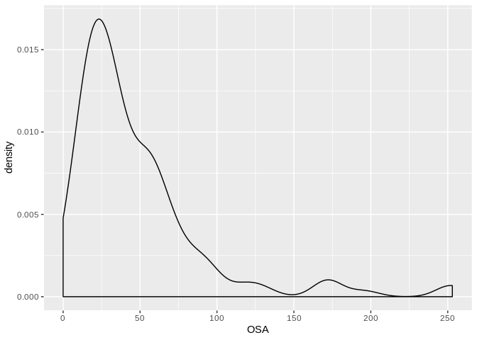

## 0\. Introduction

Kunqu Opera is a genre of Chinese opera, which is both poetry and
performing arts. As for the literature side, a Kunqu Opera is mainly
consists of rhyming poems which conforms to strict music theories and
phonetic rules. But since it’s also performing arts, during actual
performance the artists often modify its scripts, to different degrees.

Peony Pavilion is a masterpiece in the genre of Kunqu Opera. It’s
written in seventeenth centuries and contains 55 acts in its original
text. But only a small subset of it is often performed.

In this project, we would try to measure the text deviation of the
actual scripts from the original text for the subset of Peony Pavilion
which is often played.

## 1\. Initialisation

Before actual analysis, we first needs to install and load the packages
needed. And the usage of those packages are given below:

``` r
# Load required packages, and try to install them if not yet installed
source('./bin/initPackage.R')
# rvest                 : HTML-scrapping
# glue, stringr, stringi: String manipulation
# stringdis             : Calculating string distance
# purrr                 : Mapper and Reducer
# ggplot2               : Visualisation
# data.table            : Enhanced data.frame
initPackage(c('rvest', 'purrr', 'glue', 'stringr', 'stringi', 'stringdist',
              'ggplot2', 'data.table'))
```

Except from R packages, we would also use an external tool, PhantomJS to
scrap the web pages. The ‘rvest’ package works great for static web
pages, but cannot render dynamic contents well. PhantomJS has a built-in
render for JavaScript and we would use it to obtain the raw HTML files,
and then use ‘rvest’ package to navigate through the nodes of the the
HTML. We will use the scripts below to download PhantomJS according to
the operating
system.

``` r
# Download PhantomJS to current working directory if it's not downloaded yet,
# which is required to scrap the text corpus  of Peony Pavillion
# This scripts need not to be sourced here because the downloading script will
# source it when PhantomJS is needed.
source('./bin/initPhantomJS.R')
initPhantomJS()
```

PhantomJS alone only provides a interface for web scraping, and we wrote
a JavaScript program, i.e. ‘scrape.js’, for actual scraping. It takes
two arguments, which specify the URL to target web page and the
destination where we’d like to store the downloaded raw HTML files.

## 2\. Data Preparation

With the environment set up properly, we’d be able to obtain the data.

First we need to acquire the URLS to the text corpus we need, which are
acquired from the two data sources introduced below. The first one is
gongchepu.net, where volunteers have manually input a subset of Peony
Pavilion that is frequently played. Aside from the text corpus, there’s
also music notation available. But in the scope of this project, the
text corpus is all we need. Our second data source is wikisource.org. It
belongs to the same organisation behind Wikipedia, and provides a huge
set of text corpus freely to the public. In this project, we would
obtain the original script of all 55 acts of Peony Pavilion from
Wikisource.

``` r
# The following two scripts would acquire the URLs to the actual text corpus
# from the two aforementioned data scource. They don't need to be sourced here,
# since the downloading script will source them to acquire the URLs.
#source('./bin/dlGongchepuMenu.R')
#source('./bin/dlWikisourceMenu.R')
```

As the next step, we would download the HTML files given the URLs we
just extracted, and store them locally. Storing the raw HTML files
locally serves two purposes:

1.  If there were structural changes in the web pages, or if the
    relevant text web pages were not accessible due to certain reasons,
    then we would still be able to obtain the text corpus based on the
    cached HTML files.
2.  Processing cached HTML files would reduce the traffic to the target
    websites, and in many real world scenarios, this may help to
    circumvent rate limits imposed by web service
providers.

<!-- end list -->

``` r
# The following two scripts would download the target HTML filesand store them
# locally under ./data/gongchepu and ./data/wikisource directories respectively.
source('./bin/dlGongchepu.R')
source('./bin/dlWikisource.R')
dlGongchepu()
```

    ## All files are downloaded under "data/gongchepu" dir

``` r
dlWikisource()
```

    ## All files are downloaded under "data/wikisource" dir

Based on the raw HTML files we downloaded, we will use the HTML and CSS
tags to pin down the HTML elements containing the text corpus, and
extract relevant information with the help of regular expression, and
generate a data frames with the text and name of each verses.

``` r
source('./bin/processGongchepu.R')
DTGongchepu <- processGongchepu()
source('./bin/processWikisource.R')
DTWikisource <- processWikisource()
```

Below we printed out the first three rows of each data frame as an
example.

``` r
head(DTGongchepu, 3)
```

    ##     Qupai
    ## 1: 夜行船
    ## 2: 香遍𣼛
    ## 3: 懶畫眉
    ##     Lyrics
    ## 1: 瞥下天仙何處也？影空濛、似月籠紗。有恨徘徊，無言窨約，早是夕陽西下。一片紅雲下太清，如花巧咲玉娉婷。憑誰畫出生香靣？對俺偏含不語情。小生自從拾得一幅春容，日夜思想。到這更闌時節，破些工夫，吟其珠玉，玩其精神。倘得梦裡相親，也當春風一度。看這美人呵！神含欲雨，眼注微波。正是：落霞與孤鶩齊飛，秋水共長天一色。想這美人呵，
    ## 2: 晚風吹下、武陵溪邊一縷霞，出托個人兒風韵殺。净無瑕，明𥦗新絳紗。丹青小畫，又把一幅肝腸挂。美人吓，則被你想煞我柳梦梅也。
    ## 3: 輕輕怯怯一個女姣娃，椘椘臻臻像個宰相衙。想他春心無那，對菱花含情自把春容畫。可想到有個拾翠人兒也逗着他？

``` r
head(DTWikisource, 3)
```

    ##     Qupai
    ## 1: 孤飛鴈
    ## 2: 金錢花
    ## 3: 尾犯序
    ##     Lyrics
    ## 1: 世路平消長，十年事老頭兒心上。柳郎君翰墨人家長。無營運，單承望，天生天養，果樹成行。年深樹老，把園圍拋漾。你索在何方？好沒主量。悽惶，趁上他身衣口糧。「家人做事興，全靠主人命。主人不在家，園樹不開花。」俺老駝一生依著柳相公種果為生。你說好不古怪：柳相公在家，一株樹上摘百十來箇果兒；自柳相公去後，一株樹上生百十來箇蟲。便胡亂結幾箇兒，小廝們偷箇盡。老駝無主，被人欺負。因此發箇老狠，體探俺相公過嶺北來了，在梅花觀養病，直尋到此。早則南安府大封條封了觀門。聽的邊廂人說，道婆為事走了，有箇姪兒癩頭黿是小西門住。去尋問他。「抹過大東路，投至小西門。」
    ## 2: 自小疙辣郎當，郎當。官司拏俺為姑娘，姑娘。盡了法，腦皮撞。得了命，賣了房。充小廝，串街坊。「若要人不知，除非己不為。」自家癩頭黿便是。這無人所在，表白一會。你說姑娘和柳秀才那事幹得好，又走得好！只被陳教授那狗才，稟過南安府，拏了俺去。拷問俺：「姑娘那裏去了？劫了杜小姐墳哩！」你道俺更不聰明，卻也頗頗的。則掉著頭不做聲。那鳥官喝道：「馬不弔不肥，人不拶不直，把這廝上起腦箍來。」哎也，哎也，好不生疼！原來用刑人先撈了俺一架金鐘玉磬，替俺方便，稟說這小廝夾出腦髓來了。那鳥官喝道：「撚上來瞧。」瞧了，大鼻子一颩，說道：「這小廝真箇夾出腦漿來了。」他不知是俺癩頭上膿。叫鬆了刑，著保在外。俺如今有了命，把柳相公送俺這件黑海青穿擺將起來。擺搖搖，擺擺搖。沒人所在，被俺擺過子橋。小官唱喏。俺小官子腰閃價，唱不的子喏。比似你箇駝子唱喏，則當伸子箇腰。這賊種，開口傷人。難道做小官的背偏不駝？刮這駝子嘴，偷了你什麼？賊？別的罷了。則這件衣服，嶺南柳相公的，怎在你身上？咳呀，難道俺做小官的，就沒件乾淨衣服！便是嶺南柳家的，隔這般一道梅花嶺，誰見俺偷來？這衣帶上有字。你還不認，叫地方。罷了，衣服還你去囉。耍哩！俺正要問一箇人。誰？柳秀才那裏去了？不知。你不說，叫地方去。罷了，大路頭難好講話。演武廳去。好箇僻靜所在。咦，柳秀才到有一箇。可是你問的不是？你說得像，俺說；你說不像，休想叫地方，便到官司，俺也只是不說。這小廝到賊。聽俺道來：
    ## 3: 提起柳家郎，他俊白龐兒，典雅行藏。是了。多少年紀？論儀表看他，三十不上。是了。你是他什麼人？他祖上、傳留下俺栽花種糧。自小兒，俺看成他快長。原來你是柳大官。你幾時別他，知他做出甚事來？春頭別，跟尋至此，聞說的不端詳。這老兒說的一句句著。老兒，若論他做的事，咦！呸，左則無人，耍他去。老兒你聽者。

## 3\. Measure of Text Deviation

With the data prepared, we will compute the text deviation now. But
before that, there’s one extra step needed.

In the end of last section where we output the first three rows of both
data frames, there appear to be some characters that are not displayed,
even if the operating system is able to display Chinese characters. The
reason is that, only a small subset of Chinese characters are often
used, and there’s no operating system now that is able to print the
whole set of Chinese characters.

Although we would still be able to match unprintable characters since we
can match them by their Unicode representation, but the real problem is,
people may use substitute a rare characters with a more common one. This
means that we may not be able to match the texts from the two data
sources just by the name of each verses. And not even to mention that
the names of verses are highly duplicated.

The solution is, we will first calculate the text distance of all
combinations of verses from the two data sets, and for each one in the
often-performed subset, we will choose the one with smallest text
distance as its ‘fuzzy match’. And then we would only keep those
‘matched’ one, and explore the distribution of the text deviation.-

Below are the available measures of text distance of ‘stringdist’
package: - osa Optimal string alignment, (restricted Damerau-Levenshtein
distance). - lv Levenshtein distance (as in R’s native adist). - dl Full
Damerau-Levenshtein distance. - lcs Longest common sub-string distance.
- hamming Hamming distance (a and b must have same number of
characters). - qgram q-gram distance. - cosine cosine distance between
q-gram profiles - jaccard Jaccard distance between q-gram profiles - jw
Jaro-Winkler distance.

``` r
# Applying different string matching methods
# https://www.r-bloggers.com/fuzzy-string-matching-a-survival-skill-to-tackle
# -unstructured-information/
# We've stored the text distances in a csv file and we will use that instead of
# calculating agian.
source('./bin/getTextDistance.R')
DTDistance <-
  getTextDistance(DTGongchepu[,Lyrics],
                  DTWikisource[,Lyrics],
                  c( 'osa', 'lv', 'dl', 'lcs'))
```

The q-gram based methods won’t generate meaningful result because
phrases of Chinese language is not separated by white spaces as in most
languages. We tried the OSA, LV distance, DL distance and LCS. It turns
out that LCS distance hardly gives any meaningful result while the other
three measures suggests similar matches. Thus we will use the matches
measured by OSA in the next step.

``` r
# Take 5 random samples
set.seed(222)
idx = sample(1:nrow(DTGongchepu), 5)
DTMatchOSA <-
  data.table(gongchepu = DTGongchepu[idx, Lyrics],
             wikisource = DTWikisource[unlist(DTDistance[1, ])]$Lyrics[idx])
DTMatchLV <-
  data.table(gongchepu = DTGongchepu[idx, Lyrics],
             wikisource = DTWikisource[unlist(DTDistance[2, ])]$Lyrics[idx])
DTMatchDL <-
  data.table(gongchepu = DTGongchepu[idx, Lyrics],
             wikisource = DTWikisource[unlist(DTDistance[3, ])]$Lyrics[idx])
DTMatchLCS <-
  data.table(gongchepu = DTGongchepu[idx, Lyrics],
             wikisource = DTWikisource[unlist(DTDistance[4, ])]$Lyrics[idx])
```

We will store the matched pairs in a CSV files, so that readers can
check it visually.

``` r
# Only keep the distance measured by osa
DT <-
  data.table(gongchepu = DTGongchepu[, Lyrics],
             wikisource = DTWikisource[unlist(DTDistance[1, ])]$Lyrics[])
fwrite(DT, './data/matchedOSA.csv')
```

And after matching these text, now we will visualise the distribution of
the text deviation now.

``` r
OSADistance <-
  data.table(i = 1: nrow(DTGongchepu),
             OSA = apply(stringdistmatrix(DTGongchepu[,Lyrics],
                                                  DTWikisource[,Lyrics],
                                                  c('osa')),
                                 1, min))
ggplot(OSADistance, aes(OSA)) + geom_density()
```

<!-- -->

## 4\. Summary

In this project, we acquired two text corpus from two sources,
Gongchepu.net and Wikisource, and matched them by Optimal String
Alignment. The density plot is given and it turns out that, the mean OSA
measure is around 25. In the future, we could apply this framework to
compare text corpus from other sources.
